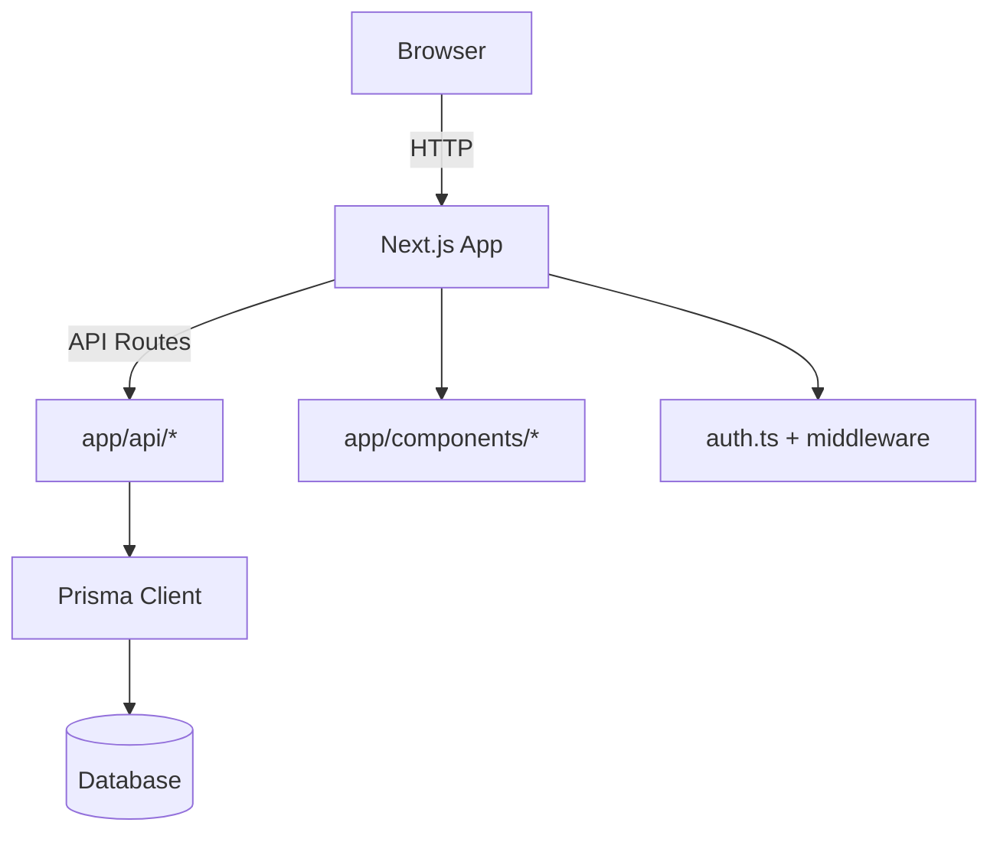

This is a Next.js 15 app (App Router) with Prisma, Auth, and a modular UI system. Below is a quick architecture overview; see `docs/ARCHITECTURE.md` for details.

### Architecture Overview

- App Router under `app/` with API routes in `app/api/*` and UI in `app/components/*`.
- Data layer powered by Prisma in `prisma/` and `app/lib/prisma.ts`.
- Auth via NextAuth configuration in `auth.ts` and middleware in `middleware.ts`.
- Shared utilities in `utils/` and `app/lib/` (e.g., `googleAds.ts`, `zohoService.ts`).



## Getting Started

First, run the development server:

```bash
npm run dev
# or
yarn dev
# or
pnpm dev
# or
bun dev
```

Open [http://localhost:3000](http://localhost:3000) with your browser to see the result.

You can start editing the page by modifying `app/page.tsx`. The page auto-updates as you edit the file.

This project uses [`next/font`](https://nextjs.org/docs/app/building-your-application/optimizing/fonts) to automatically optimize and load [Geist](https://vercel.com/font), a new font family for Vercel.

## Learn More

To learn more about Next.js, take a look at the following resources:

- [Next.js Documentation](https://nextjs.org/docs) - learn about Next.js features and API.
- [Learn Next.js](https://nextjs.org/learn) - an interactive Next.js tutorial.

You can check out [the Next.js GitHub repository](https://github.com/vercel/next.js) - your feedback and contributions are welcome!

## Deploy

You can deploy to Vercel or any Node hosting. Ensure environment variables are configured (see `ENV_VARIABLES.md`) and the database is migrated.
