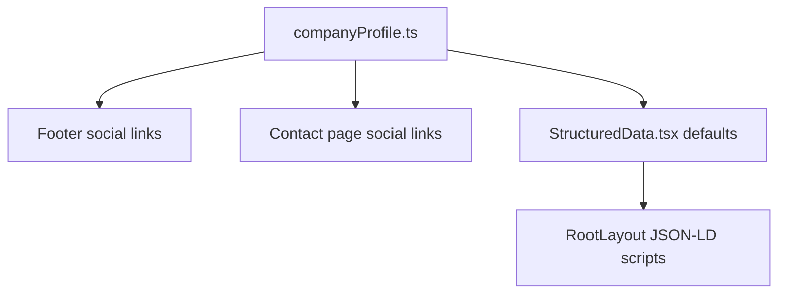

## Company Profile (Authenticity + SEO Source of Truth)

File: `app/data/companyProfile.ts`

This module centralizes **real company identity** used across:

- **UI trust badges** (CIN/GST/legal name)
- **Structured data (JSON-LD)** in `app/layout.tsx`
- **Footer/Contact social links** (only render if real URLs exist)

### Why this improves authenticity

- **No more placeholder/fake data** (e.g., random addresses or `href="#"` social icons)
- **Consistent legal identifiers** across pages (CIN/GST/incorporation year)
- **Lower “scam signals”** for users and for crawlers evaluating trust

### How to update

Edit `app/data/companyProfile.ts`:

- **`legal.cin` / `legal.gst`**: must match `/pages/legal/company-info`
- **`social`**: only add verified public URLs; otherwise keep empty

### Rendering behavior

- If `companyProfile.social.<network>` is **missing**, icons for that network **will not render**.
- Email icon is always shown (uses `companyProfile.contactEmail`).

### Flow (high level)

