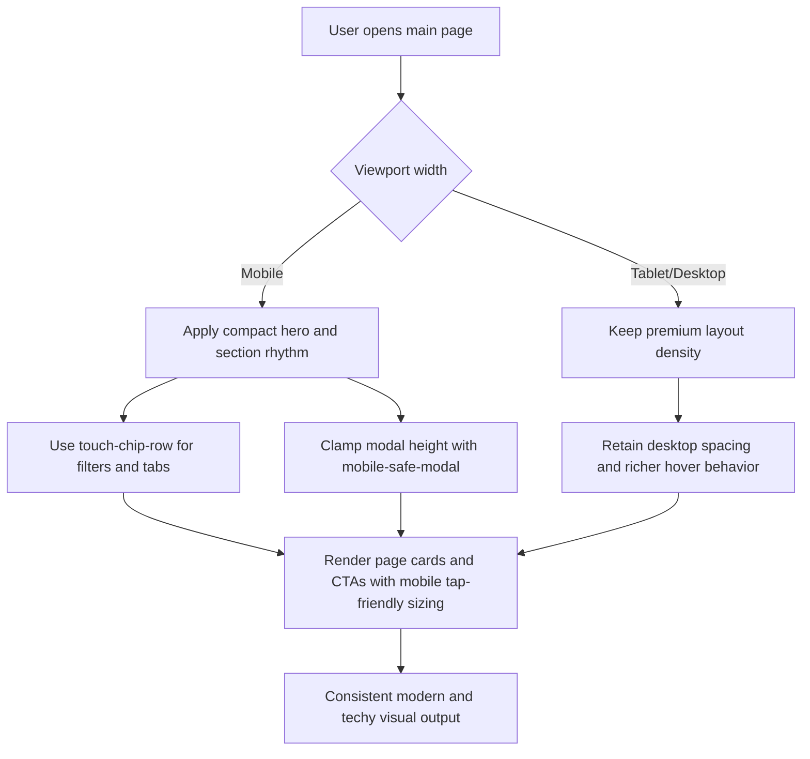

# Main Pages Mobile Compact Redesign Guide

## Scope

This document covers the mobile-first compact redesign for the primary marketing pages:

- `/` (Home)
- `/pages/about`
- `/pages/services`
- `/pages/portfolio`
- `/pages/blog`
- `/pages/resources`
- `/pages/contact`

## What Was Standardized

1. **Compact vertical rhythm**
   - Shared spacing utilities added in `app/globals.css`:
     - `.compact-main-hero`
     - `.compact-main-section`
2. **Touch-first navigation patterns**
   - Horizontal chip rows for filters/tabs:
     - `.touch-chip-row`
3. **Mobile-safe overlays/modals**
   - Shared modal clamp class:
     - `.mobile-safe-modal`
4. **Balanced headline wrapping**
   - `.text-balance` utility for cleaner title breaks on small viewports.

## Implementation Flow (Module-Level)

## Files Updated

- `app/globals.css`
- `app/layout.tsx`
- `app/components/EnhancedHeader.tsx`
- `app/page.tsx`
- `app/pages/about/page.tsx`
- `app/pages/services/page.tsx`
- `app/pages/portfolio/page.tsx`
- `app/pages/blog/page.tsx`
- `app/pages/resources/page.tsx`
- `app/pages/contact/page.tsx`

## Validation Checklist

- Mobile hero sections no longer feel oversized.
- Section padding is consistent across primary pages.
- Tab/filter controls remain usable on narrow screens.
- Modals fit safely within mobile viewport height.
- Desktop visual quality remains premium.
