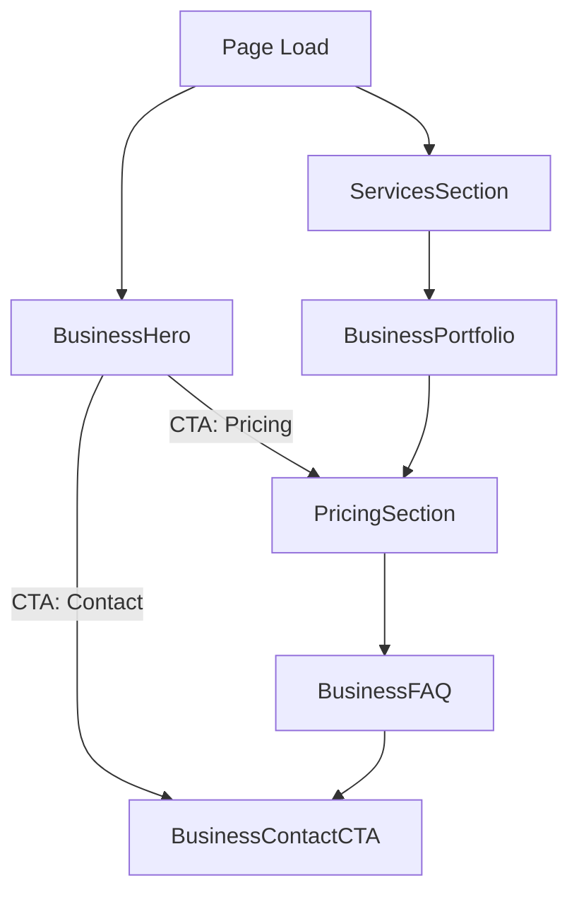

## Business Website Page Module

This module renders the Business Website landing page composed of multiple sections, with consistent layout, accessibility, and defensive error handling.

### Sections
- `BusinessHero`: Hero with animated globe and CTAs
- `ServicesSection`: Offering highlights in a responsive grid
- `BusinessPortfolio`: Case studies with featured layout
- `PricingSection`: One-time pricing with currency toggle (INR/USD)
- `BusinessFAQ`: Collapsible FAQ accordion
- `BusinessContactCTA`: Strong end CTA

Each section is wrapped by `SectionErrorBoundary` to ensure resilient rendering and user-friendly fallbacks.

### Layout & Responsiveness
- Unified vertical rhythm: `py-20 md:py-28` across sections
- Consistent content width via `container mx-auto px-4`
- Responsive animated globe: respects device pixel ratio and resizes on viewport changes

### Accessibility
- Sections are `role="region"` and labeled with `aria-labelledby`
- FAQ uses `aria-expanded`, `aria-controls` for toggles
- Interactive controls include `aria-label`s where useful
- Reduced motion preference respected for the globe animation

### Logging & Diagnostics
Console logs are added across sections to aid debugging during development:
- Mount/unmount logs for each section
- Currency toggle and FAQ toggle logs
- Image load error logs in portfolio
- Globe initialization and draw errors

### Error Handling
- `SectionErrorBoundary` catches render-time errors and renders a safe fallback
- Portfolio images use a safe remote placeholder on load failure

### High-level Flow

### Notes / Next Enhancements
- Consider switching to Next/Image with a configured domain allowlist for better image performance
- Add structured data (JSON-LD) for Organization and Product/Service
- Add analytics + event tracking for CTA clicks and pricing toggle
- Add e2e tests (Playwright) for critical flows and a11y checks (axe)

