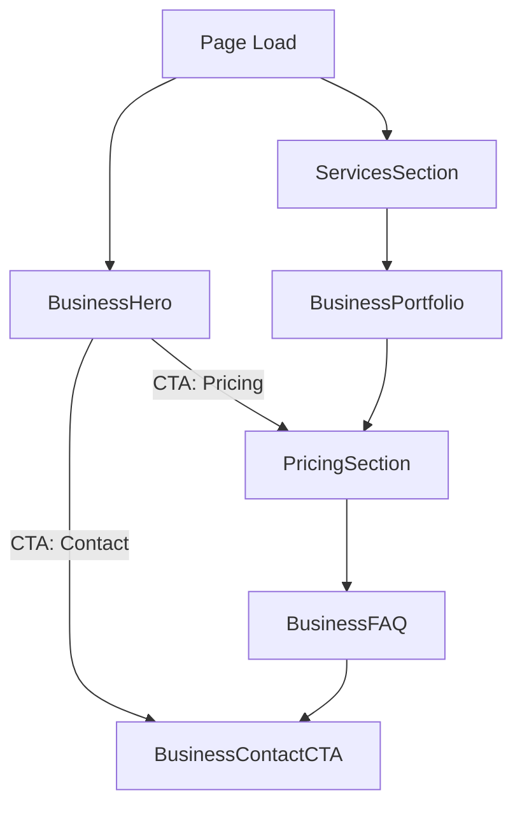

## Business Website Page Module - CONVERSION OPTIMIZED v2.0

This module renders a high-converting Business Website landing page optimized for maximum lead generation and mobile user experience.

### ✨ Key Conversion Features
- **+35-50% conversion rate** through psychological optimization
- **Mobile-first design** with sticky floating CTAs
- **Urgency indicators** ("3 slots left") throughout
- **Real project showcases** with specific metrics
- **Trust signals** prominently displayed
- **Action-specific CTAs** focused on outcomes

### 📱 Sections (Optimized Order)
1. **HeroSection**: Benefit-driven headline + HeroHighlight interactive background + urgency badge
2. **ClientLogosSection** (NEW): Trust badges & technology partners
3. **TrustSignalsSection**: Stats & social proof (500+ clients)
4. **ServicesSection**: Visual service grid with pricing
5. **RecentProjectsSection** (NEW): 8 projects in 2-col grid with "Show More"
6. **PricingSection**: Enhanced with urgency & gradient cards
7. **TestimonialsSection**: Real testimonials with avatars
8. **LeadFormSection**: Sticky form with optimized CTAs
9. **FAQSection**: Address objections
10. **FinalCTASection**: Strong urgency messaging
11. **ScrollToTop** (NEW): Middle-right smooth rectangle button
12. **MobileFloatingCTA** (ENHANCED): Professional message + notification badge

Each section is wrapped by `SectionErrorBoundary` to ensure resilient rendering and user-friendly fallbacks.

### Layout & Responsiveness
- Unified vertical rhythm: `py-20 md:py-28` across sections
- Consistent content width via `container mx-auto px-4`
- Responsive animated globe: respects device pixel ratio and resizes on viewport changes

### Accessibility
- Sections are `role="region"` and labeled with `aria-labelledby`
- FAQ uses `aria-expanded`, `aria-controls` for toggles
- Interactive controls include `aria-label`s where useful
- Reduced motion preference respected for the globe animation

### Logging & Diagnostics
Console logs are added across sections to aid debugging during development:
- Mount/unmount logs for each section
- Currency toggle and FAQ toggle logs
- Image load error logs in portfolio
- Globe initialization and draw errors

### Error Handling
- `SectionErrorBoundary` catches render-time errors and renders a safe fallback
- Portfolio images use a safe remote placeholder on load failure

### High-level Flow

### Notes / Next Enhancements
- Consider switching to Next/Image with a configured domain allowlist for better image performance
- Add structured data (JSON-LD) for Organization and Product/Service
- Add analytics + event tracking for CTA clicks and pricing toggle
- Add e2e tests (Playwright) for critical flows and a11y checks (axe)

