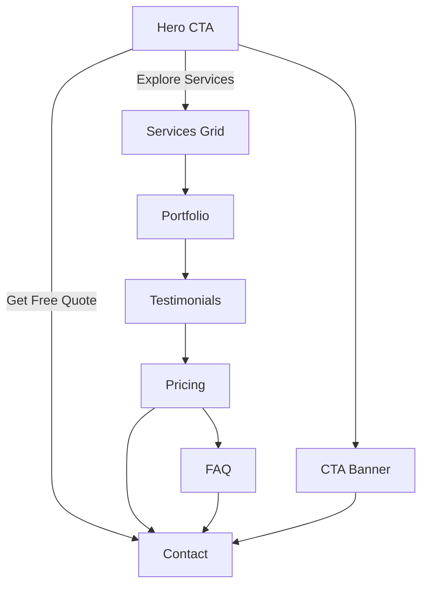

## Web Development Landing Page

This module assembles a premium, conversion-focused landing page for the `pages/web-development` route using existing reusable sections and two new sections.

### Sections Used
- Hero: `app/pages/website-development/_components/hero-section.tsx`
- Services Grid: `app/pages/web-development/_components/services-grid-section.tsx`
- Services (bento): `app/pages/website-development/_components/services-section.tsx`
- Portfolio: `app/pages/website-development/_components/portfolio-section.tsx`
- Testimonials: `app/pages/website-development/_components/testimonials-section.tsx`
- Pricing: `app/pages/web-development/_components/pricing-section.tsx`
- FAQ: `app/pages/website-development/_components/faq-section.tsx`
- CTA Banner: `app/pages/website-development/_components/animated-banner-cta.tsx`
- Contact: `app/pages/website-development/_components/contact-section.tsx`

### Components
- `Button`, `Spotlight` from `app/components/ui` for shadcn-like styling and Accernity-style spotlight effect.
- `SectionErrorBoundary` wraps each section for robust runtime safety and error visibility.

### Page Composition
File: `app/pages/web-development/page.tsx`

Flow:
1. Hero
2. Services Grid (icons-first; compact info)
3. Services (bento layout)
4. Portfolio / Case Studies
5. Testimonials
6. Pricing (3 tiers)
7. FAQ
8. CTA Banner
9. Contact

### Metadata
Route metadata lives in: `app/pages/web-development/metadata.ts`.

### Animation & UX
- Entrance animations via `framer-motion` with staggered cards.
- Mobile-first: single column stacks; desktop: grid, hover accents.
- Primary gradient tone: blue → purple per existing brand tone.

### Console Logs
Sections log mount/unmount events for debugging:
- "[Web-Development] ServicesGridSection mounted" etc.

### Flow Chart (Mermaid)

### Keep Docs and Code in Sync
- If you change section order or CTAs, update this README accordingly.
- Keep service labels consistent across Services Grid, Pricing, and CTA copy.

