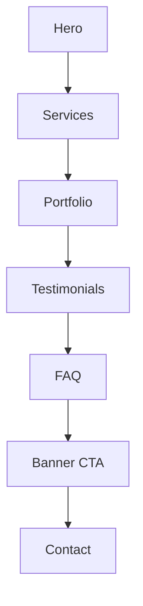

## Website Development Page Module

This module composes the website development landing page with resilient sections, consistent layout, and accessibility.

### Sections
- `HeroSection`: Animated hero with mockup and CTAs
- `ServicesSection`: Bento grid of services
- `PortfolioSection`: Filterable portfolio with hover states
- `TestimonialsSection`: Carousel with autoplay and controls
- `FAQSection`: Accordion with proper a11y semantics
- `AnimatedBannerCta`: Promotional CTA
- `ContactSection`: Form and contact details

All sections are wrapped in `SectionErrorBoundary` at `page.tsx` for graceful degradation.

### Conventions
- Layout rhythm: `py-20` (and larger where needed), `container mx-auto px-4`
- Accessibility: `role="region"`, `aria-labelledby` for headings, `aria-pressed` for toggles, `aria-expanded` for accordions
- Logging: mount/unmount logs in key sections, event logs for toggles and image errors
- Resilience: guard array maps, lazy images with error handlers

### Flow

