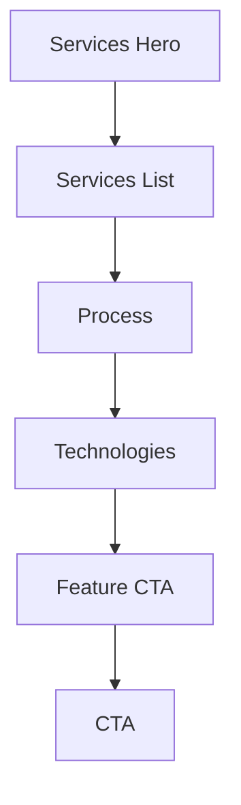

## Website Services Page Module

Sections on this page are wrapped by `SectionErrorBoundary` to ensure resilience. The `TechnologiesSection` includes a category switcher with a11y attributes and diagnostic logs.

### Sections
- `ServicesHero`, `ServicesList`, `ProcessSection`, `TechnologiesSection`, `FeatureCta`, `Cta`

### Conventions
- Layout: `container mx-auto px-4`, vertical rhythm consistent with adjacent pages
- A11y: labeled regions via `aria-labelledby`, control semantics via `aria-pressed`, expanded states on accordions
- Logging: mount/unmount and interaction logs for easier debugging

### Flow

