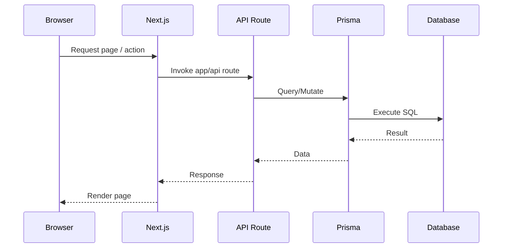

## Architecture

This document outlines the high-level architecture of the application.

### Modules

- `app/`: App Router pages, layouts, and API routes (`app/api/*`).
- `app/components/`: Reusable UI components and UI primitives under `ui/`.
- `app/lib/`: Library helpers and integrations (e.g., Google Ads, Prisma).
- `app/lib/seo/`: Central SEO helpers for metadata, canonical URLs, and sitemap route inputs.
- `prisma/`: Schema and seed scripts.
- `utils/`: Shared utilities (sitemap, service worker helpers, etc.).

### Request Flow

### Authentication

- Configured via `auth.ts` and `middleware.ts` for route protection.

### Data

- Prisma connects to the configured database. Migrations and seeding via `pnpm db:*` scripts.

