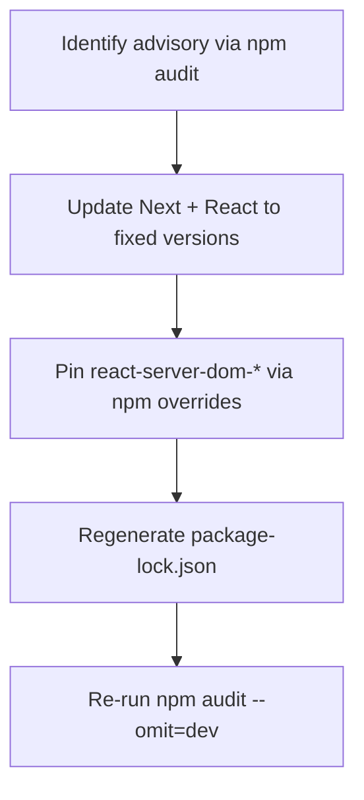

## React / Next security advisory upgrade

This repo was updated to address the **official React / Flight protocol advisory** as surfaced via `npm audit` (Next.js + React Server Components / Flight).

### What changed

- **`next`**: upgraded to the latest stable **15.x** patch release (`15.5.9`).
- **`react` / `react-dom`**: upgraded to the latest stable (`19.2.3`).
- **`react-server-dom-*`**: pinned to the latest stable fixed versions via **`npm overrides`**:
  - `react-server-dom-webpack@19.2.3`
  - `react-server-dom-parcel@19.2.3`
  - `react-server-dom-turbopack@19.2.3`

Note: these `react-server-dom-*` packages are **not direct dependencies** of this app at the time of writing, so overrides are used as a **defense-in-depth** pin in case they are introduced transitively by tooling (e.g., future Next internals / plugins).

### How to verify

From the repo root:

```bash
npm install
npm audit --omit=dev
```

Expected result: **0 vulnerabilities** in production dependencies.

### Dependency update flow (high level)



